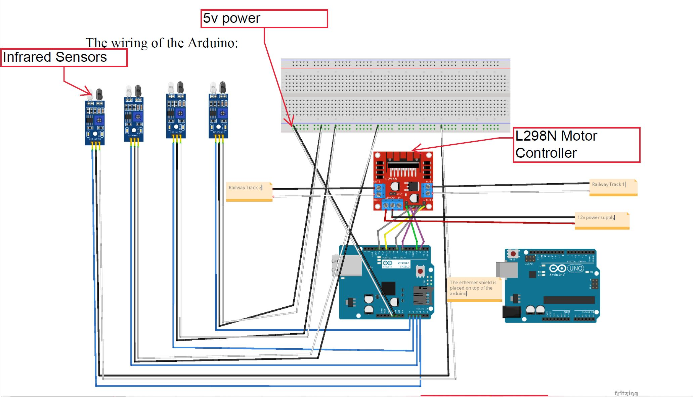

# Vulnerable-Traffic-Controller
## Overview
I built a simulated traffic network with traffic lights that mimics the real world. In addition to the simulation, I created a model train station controlled by traffic lights to illustrate the disaster that occurs when the traffic network is attacked and successfully exploited. The attack was the collision of two trains. Traffic control systems are widely used worldwide to optimize traffic flow, and threat actors can leverage vulnerable systems to cause accidents and disrupt emergency services.
A web interface was built to display varying traffic flow, and a power switch is needed for a traffic operator specialist to perform their role.
The simulated traffic control system was built with a siemens s7 1200 PLC, housing the logical functions of the environment. In addition, an Arduino is attached with an Ethernet Shield w5100, Infrared obstacle avoidance sensors, model trains, and a model railway.

# Paper
* 
# Images
Live Action

PLC Sketch

Arduino Sketch
PLC Sketch
